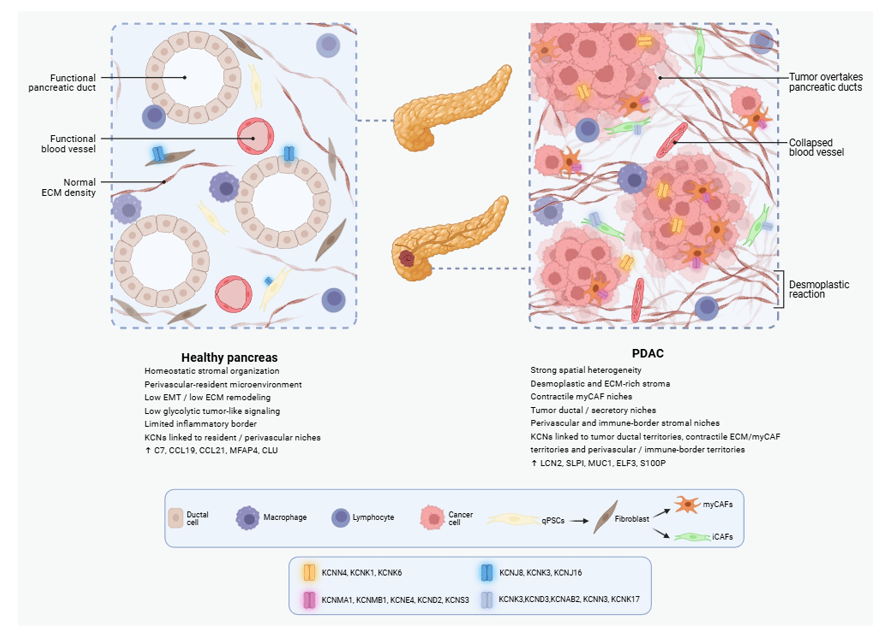

# M1 Bioinformatics Ion Channel Project

Pancreatic ductal adenocarcinoma (PDAC) is a highly desmoplastic cancer in which tumor cells coexist with a dense and heterogeneous stromal compartment. Fibroblast states, extracellular matrix remodeling, and tumor-stroma organization are therefore central to PDAC biology. This project focuses on potassium channel candidates that may help structure stromal activation, quiescent stromal states, and tumor-associated territories across complementary transcriptomic data layers.

**Figure overview.** Simplified biological model of the KCN landscape discussed in this project, highlighting the stromal-associated candidates `KCNMA1` and `KCNJ8`, and the tumor-associated counterpoint `KCNN4` in PDAC.

## Biological rationale

The main question of the project is whether selected ion channels, especially potassium channels, may be linked to extracellular matrix organization, stromal plasticity, or immune-related programs in PDAC. The report is centered on three representative genes: `KCNMA1` for an activated stromal pole, `KCNJ8` for a more quiescent or resident-like stromal pole, and `KCNN4` for a tumor epithelial counterpoint.

## Project overview

This repository contains the data processing, statistical analyses, and report assets used for a Master 1 internship project on ion channels in pancreatic ductal adenocarcinoma. The report follows a multi-level workflow built around stromal single-cell discovery, external snRNA-seq validation, bulk perturbation analysis in CAFs, spatial transcriptomics, and a secondary clinical opening based on bulk survival cohorts.

The repository is organized so that each analysis block can be read independently, rerun locally, and connected back to the final report figures.

## Repository structure

- `code/`
  Main analysis scripts, local outputs, and block-specific `README.md` files.
- `data/`
  Curated RDS objects and other main data resources reused across analyses.
- `bibliographie/`
  Papers and supporting literature used to interpret datasets, methods, and biological context.
- `Rapport_figures/`
  Final figure assets used in the written report.
- `report_latex/`
  LaTeX source of the report and compiled PDF.

## Main analysis blocks

- `code/moffitt_stromal_exploration_outputs/`
  Stromal-focused Moffitt single-cell exploration.
- `code/moffitt_kcn_deg_4_methods/`
  Four-method KCN differential expression overlap in the Moffitt stromal branch.
- `code/moffitt_qpsc_vs_mycaf_gsea/`
  Direct pseudobulk Hallmark GSEA between qPSC and myCAF.
- `code/user_moffitt_validation/`
  External validation in the USER snRNA-seq atlas.
- `code/bulk/BKCA_shBKCA/`
  Bulk RNA-seq analysis of BKCa silencing in CAFs.
- `code/spatial_pdac_analysis/`
  Spatial transcriptomic analyses and communication-focused spatial follow-up runs.
- `code/bulk_survival_analysis/`
  Multicohort survival analyses used as a secondary clinical opening.

## Report figures: where to find the code, outputs, and tables

The final report figures are stored in `Rapport_figures/`, but each panel comes from one or more analysis folders in `code/`. The guide below is the fastest way to go from a report figure to the corresponding scripts, tables, and reusable outputs.

### F1. PDAC stromal microenvironment context

- Final report asset:
  - `Rapport_figures/F1.JPG`
- Report source:
  - `report_latex/main.tex`
- Supporting biological context:
  - `bibliographie/`

This is a conceptual figure used to introduce the biological context of PDAC stroma, myCAF/iCAF states, extracellular matrix, and tumor-stroma interactions. It is not generated from a dedicated analysis script.

### F2. Moffitt stromal scRNA-seq

- Main folders:
  - `code/moffitt_stromal_exploration_outputs/`
  - `code/moffitt_kcn_deg_4_methods/`
  - `code/moffitt_qpsc_vs_mycaf_gsea/`

Panel guide:
- `F2A` stromal UMAP:
  - figure source:
    - `code/moffitt_stromal_exploration_outputs/figures/Figure_03_UMAP_all_stromal_subtypes.png`
  - supporting tables:
    - `code/moffitt_stromal_exploration_outputs/tables/`
- `F2B` four-test DEG overlap:
  - figure source:
    - `code/moffitt_kcn_deg_4_methods/figures/Figure_02_Venn_KCN_overlap_4_methods.png`
  - supporting tables:
    - `code/moffitt_kcn_deg_4_methods/tables/`
- `F2C` pseudobulk subtype volcano:
  - figure source:
    - `code/moffitt_kcn_deg_4_methods/figures/Figure_07_Volcano_Test2_Subtype_OneVsRest.png`
  - supporting tables:
    - `code/moffitt_kcn_deg_4_methods/tables/`
- `F2D` qPSC versus myCAF GSEA:
  - figure source:
    - `code/moffitt_qpsc_vs_mycaf_gsea/figures/moffitt_qpsc_vs_mycaf_hallmark_gsea_summary.pdf`
  - supporting tables:
    - `code/moffitt_qpsc_vs_mycaf_gsea/tables/`
  - script:
    - `code/moffitt_qpsc_vs_mycaf_gsea/run_moffitt_qpsc_vs_mycaf_gsea.R`

### F3. USER snRNA-seq validation

- Main folder:
  - `code/user_moffitt_validation/`

Panel guide:
- `F3A` global USER UMAP:
  - figure source:
    - `code/user_moffitt_validation/figures/Figure_01_USER_global_umap_cell_subsets.pdf`
- `F3B` patient composition:
  - figure source:
    - `code/user_moffitt_validation/figures/Figure_06_USER_patient_cell_subset_composition.pdf`
- `F3C` transcriptome-wide tumor versus fibroblast pseudobulk volcano:
  - figure source:
    - `code/user_moffitt_validation/all_genes_pseudobulk_tumor_vs_fibroblast/figures/USER_all_genes_pseudobulk_tumor_vs_fibroblast_volcano.pdf`
  - supporting tables:
    - `code/user_moffitt_validation/all_genes_pseudobulk_tumor_vs_fibroblast/tables/`
  - script:
    - `code/user_moffitt_validation/all_genes_pseudobulk_tumor_vs_fibroblast/run_user_all_genes_pseudobulk_tumor_vs_fibroblast.R`

Additional USER outputs remain available in:
- `code/user_moffitt_validation/tables/`
- `code/user_moffitt_validation/rds/`

### F4. BKCa silencing bulk RNA-seq in CAFs

- Main folder:
  - `code/bulk/BKCA_shBKCA/`

Panel guide:
- `F4A` experimental design:
  - final report assembly:
    - `Rapport_figures/F4.png`
  - main downstream analysis folder:
    - `code/bulk/BKCA_shBKCA/`
- `F4B` differential expression volcano:
  - figure source:
    - `code/bulk/BKCA_shBKCA/figures/Volcano_plot.pdf`
- `F4C` Hallmark GSEA:
  - figure source:
    - `code/bulk/BKCA_shBKCA/figures/GSEA_Hallmark_bubbleplot.pdf`
- `F4D` CAF signature heatmap:
  - figure source:
    - `code/bulk/BKCA_shBKCA/figures/CAF_signature_heatmap_myCAF_iCAF_ifCAF_landscape.pdf`
  - supporting tables:
    - `code/bulk/BKCA_shBKCA/tables/CAF_signature_statistics.csv`
    - `code/bulk/BKCA_shBKCA/tables/CAF_signature_reference.csv`

Main script:
- `code/bulk/BKCA_shBKCA/run_bkca_shbkca_bulk_rnaseq_analysis.R`

### F5. Spatial transcriptomics overview and hotspot maps

- Main folders:
  - `code/spatial_pdac_analysis/overview/`
  - `code/spatial_pdac_analysis/spatial_maps/ecotypes/`
  - `code/spatial_pdac_analysis/communication/hotspot/all_kcns_primary/`

Panel guide:
- `F5A` spatial dataset overview:
  - figures:
    - `code/spatial_pdac_analysis/overview/figures/spots_per_section.pdf`
    - `code/spatial_pdac_analysis/overview/figures/origin_composition_by_section.pdf`
  - tables:
    - `code/spatial_pdac_analysis/overview/tables/`
- `F5B` ecotype context:
  - figures:
    - `code/spatial_pdac_analysis/spatial_maps/ecotypes/figures/normal_and_primary_ecotype_maps.pdf`
  - tables:
    - `code/spatial_pdac_analysis/spatial_maps/ecotypes/tables/`
- `F5C` representative hotspot maps:
  - figures:
    - `code/spatial_pdac_analysis/communication/hotspot/all_kcns_primary/figures/kcnma1_hotspot_primary_sections_viridis.pdf`
    - `code/spatial_pdac_analysis/communication/hotspot/all_kcns_primary/figures/kcnn4_hotspot_primary_sections_viridis.pdf`
    - related KCNJ8 spatial context:
      - `code/spatial_pdac_analysis/communication/hotspot/all_kcns_primary/figures/kcnj8_hotspot_primary_sections_viridis.pdf`
  - tables:
    - `code/spatial_pdac_analysis/communication/hotspot/all_kcns_primary/tables/`
    - `code/spatial_pdac_analysis/communication/hotspot/all_kcns_normal_pancreas/tables/`

### F6. Spatial signature projections

- Main folders:
  - `code/spatial_pdac_analysis/communication/hotspot/kcnma1_tumor_epithelial_overlay_primary/`
  - `code/spatial_pdac_analysis/communication/hotspot/kcnn4_tumor_epithelial_overlay_primary/`
  - `code/spatial_pdac_analysis/communication/hotspot/kcnma1_pathway_overlay_primary/`

Panel guide:
- `F6A` tumor epithelial signature overlays:
  - figures:
    - `code/spatial_pdac_analysis/communication/hotspot/kcnma1_tumor_epithelial_overlay_primary/figures/tumor_epithelial_kcnma1_hotspot_vs_pathway_primary.pdf`
    - `code/spatial_pdac_analysis/communication/hotspot/kcnn4_tumor_epithelial_overlay_primary/figures/tumor_epithelial_kcnn4_hotspot_vs_pathway_primary.pdf`
  - tables:
    - `code/spatial_pdac_analysis/communication/hotspot/kcnma1_tumor_epithelial_overlay_primary/tables/`
    - `code/spatial_pdac_analysis/communication/hotspot/kcnn4_tumor_epithelial_overlay_primary/tables/`
- `F6B` CAF signature projection for KCNMA1:
  - figure:
    - `code/spatial_pdac_analysis/communication/hotspot/kcnma1_pathway_overlay_primary/figures/cancer_associated_fibroblasts_kcnma1_hotspot_vs_pathway_primary.pdf`
  - supporting tables:
    - `code/spatial_pdac_analysis/communication/hotspot/kcnma1_pathway_overlay_primary/tables/`

### F7. Final schematic summary

- Final report asset:
  - `Rapport_figures/F7.JPG`
- Report source:
  - `report_latex/main.tex`
- Upstream supporting analysis:
  - `F2` to `F6` folders listed above

This figure is a synthetic report figure, not a direct script-generated plot. It summarizes the interpretation built from the Moffitt, USER, bulk, and spatial branches.

### Clinical opening: bulk survival

The survival analysis is not a main report figure block, but the code and outputs are available in:
- `code/bulk_survival_analysis/survival_kcn25_two_stage_meta/`
- `code/bulk_survival_analysis/survival_kcn25_km_within_cohort_median/`

## Languages and main software

- Main languages:
  - `R`
  - `Python`
  - shell commands for local execution
- Main R packages:
  - `Seurat`
  - `DESeq2`
  - `MAST`
  - `fgsea`
  - `msigdbr`
  - `escape`
  - `GSVA`
  - `AUCell`
  - `ggplot2`
  - `patchwork`
  - `VennDiagram`
  - `survival`
  - `sf`
  - `readxl`
- Main Python packages:
  - `scanpy`
  - `anndata`
  - `hotspot`
  - `commot`
  - `numpy`
  - `pandas`
  - `scipy`
  - `matplotlib`
  - `seaborn`
  - `scikit-learn`

## Main data sources

- `data/Stroma_Subset2021.rds`
- `data/Stroma_Subset2021_fibroblast_focus.rds`
  - stromal PDAC single-cell resource from Oh et al., *Nature Communications*
- `data/PDAC_Updated_ST.rds`
  - spatial PDAC atlas from Khaliq et al., *Nature Genetics*
- USER inputs in:
  - `code/user_moffitt_validation/inputs/`
- Local bulk perturbation inputs in:
  - `code/bulk/BKCA_shBKCA/`
  - `code/bulk/SIGMAR1_shSIGMAR1/`
- Public survival cohort bundles in:
  - `code/bulk_survival_analysis/integrated_survival_bundle/`

## Practical orientation

If the goal is to rerun or understand one part of the project quickly:

1. start from the relevant report figure above
2. open the corresponding analysis folder in `code/`
3. read the local `README.md`
4. rerun the `run_*.R` or `run_*.py` script stored next to the outputs

Good project-level entry points are:
- `code/README.md`
- `code/spatial_pdac_analysis/README.md`
- `code/user_moffitt_validation/README.md`
- `code/bulk/BKCA_shBKCA/README.md`
- `report_latex/main.tex`
